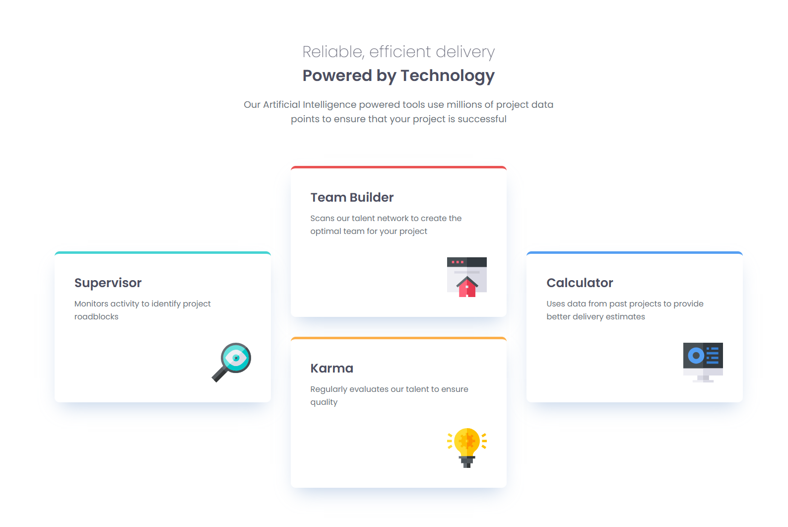

# Frontend Mentor - Four card feature section solution

This is a solution to the [Four card feature section challenge on Frontend Mentor](https://www.frontendmentor.io/challenges/four-card-feature-section-weBs9S6sH).

## Table of contents

- [Overview](#overview)
  - [The challenge](#the-challenge)
  - [Screenshot](#screenshot)
  - [Links](#links)
- [My process](#my-process)
  - [Built with](#built-with)
  - [What I learned](#what-i-learned)
- [Author](#author)

## Overview

### The challenge

Users should be able to:

- View the optimal layout for the site depending on their device's screen size.
- See hover states for interactive elements (if applicable).

### Screenshot



### Links

- Solution URL:[ \[Add your GitHub link here\]](https://github.com/PatoCatejo/four-card-feature-section)
- Live Site URL:[\[Add your GitHub Pages link here\]](https://patocatejo.github.io/four-card-feature-section/)

## My process

### Built with

- Semantic HTML5 markup
- CSS custom properties
- Flexbox (for card internal layout)
- **CSS Grid** (for the main 4-card layout)
- Mobile-first workflow
- Google Fonts (Poppins)

### What I learned

This project was a fantastic exercise in mastering **CSS Grid**. While the mobile layout is a straightforward single column, the desktop version required a more advanced grid structure.

The main takeaway was learning how to use `grid-column` and `grid-row` to span multiple cells, creating the "diamond" or "cross" shape. I used `align-items: center` on the grid container to ensure the side cards remained vertically centered within their spanned rows.

```css
/* Creating the "Diamond" layout in Desktop */
@media (min-width: 1000px) {
  .cards-grid {
    display: grid;
    grid-template-columns: repeat(3, 1fr);
    grid-template-rows: repeat(2, 1fr);
    align-items: center;
    gap: 1.8rem;
  }

  .card-cyan {
    grid-column: 1;
    grid-row: 1 / span 2;
  }

  .card-blue {
    grid-column: 3;
    grid-row: 1 / span 2;
  }
}
```

## Author

- Frontend Mentor - @PatoCatejo
- GitHub - PatoCatejo
